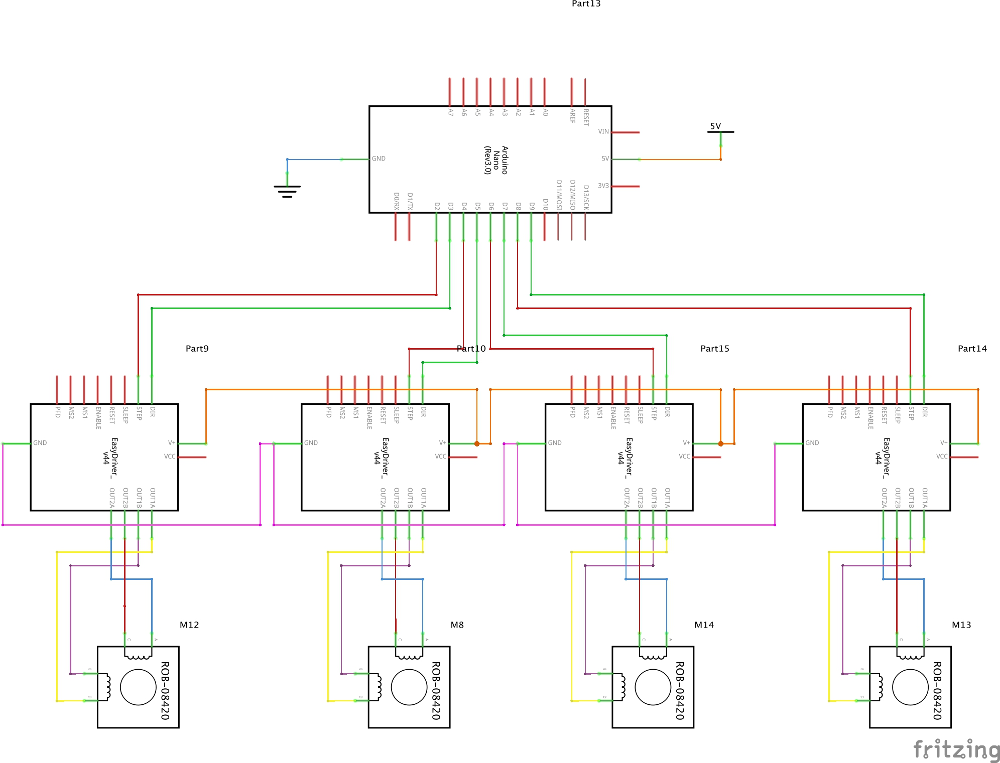
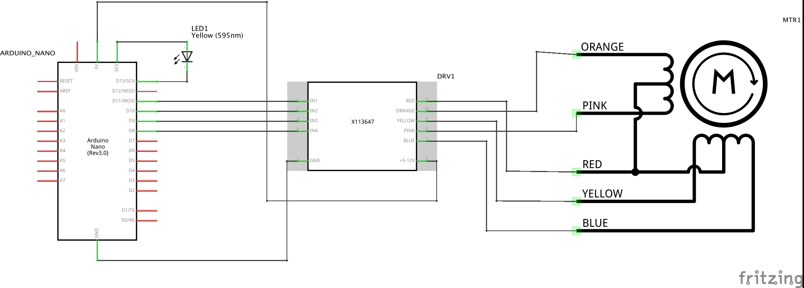

# Schematics
All schematics are made in [Fritzing](https://fritzing.org) and use their extension (.fzz). In Fritzing are three views available:
breadboard, schematic and PCB. In this folder are all our versions of the schematics in chronological order:

## firstsetup.fzz
**NOT TESTED!**
setup with 2 breadboards and a floating Arduino. The stepper motors are connected to an easydriver which then are connected to an Arduino.

## newparts.fzz
**NOT TESTED!**
Setup with custom parts ([source](https://github.com/tardate/X113647Stepper)). These are our actual parts. The custom made parts are also included in this repo at  `customparts/`.

## firstworking.fzz
Only one motor, but this one is **tested** and works! It's tested with the code at [this commit](https://github.com/bionicarm/bionicarm/tree/d6df96433fdd7d1bf2449d47284609a06bb9cc7e).

